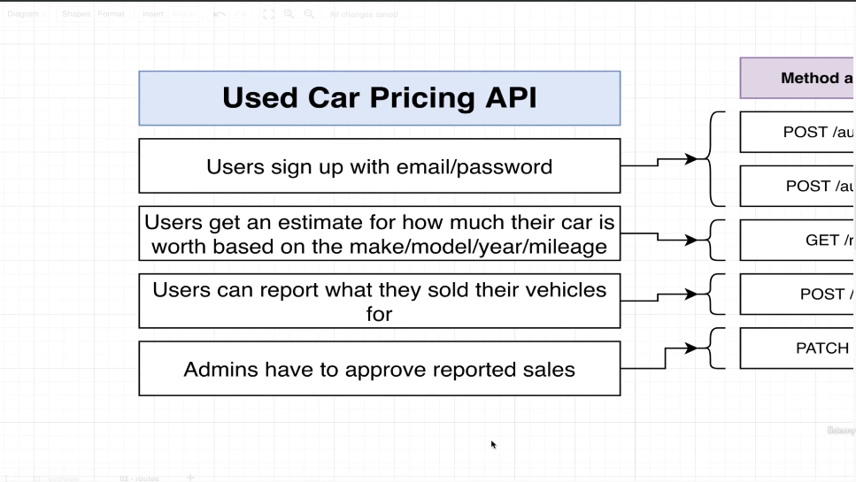
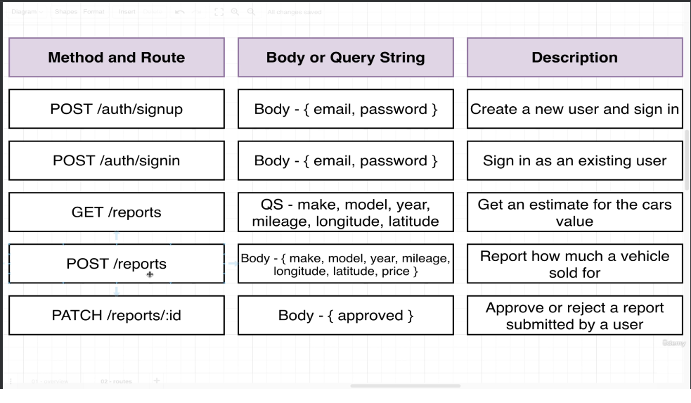

# CAR API PROJECT.
> We are going to create a project for which the people can get to know what are the prices of their car based upon some features.
> For that we will create some routes and other things which are necessary.




### Nest CLI For Generating Controllers and Services. We will not used Nest CLI for generating Repositories for us because these repositories are going to be very very different depending upon how we are storing our data. So, We will create these repository things manually.
```
nest g module users
nest g module reports
```
```
nest g controller users
nest g controller reports
```
```
nest g service users
nest g service reports
```