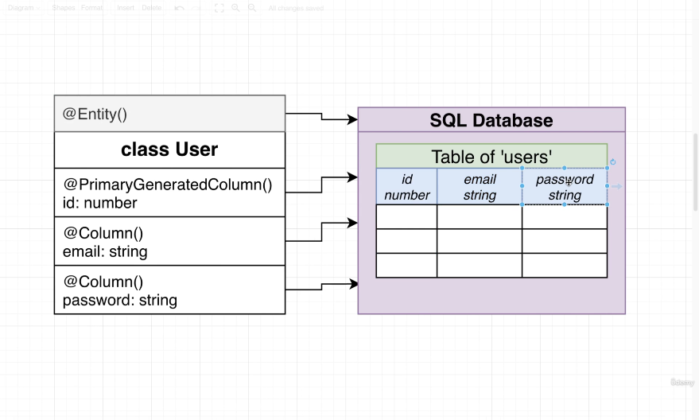
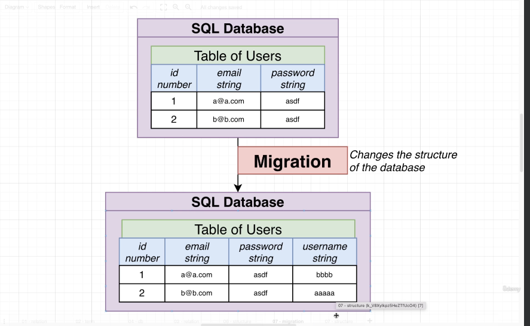
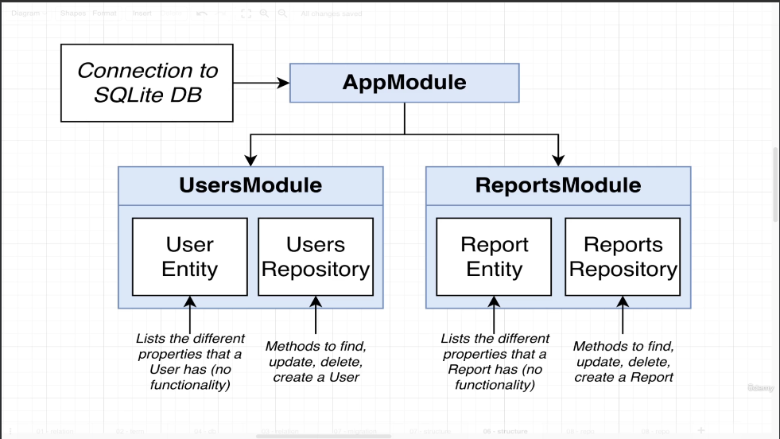
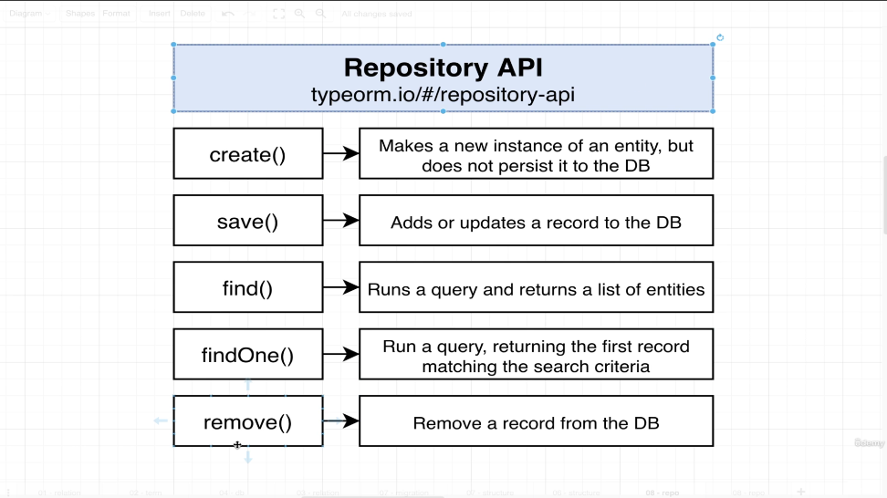
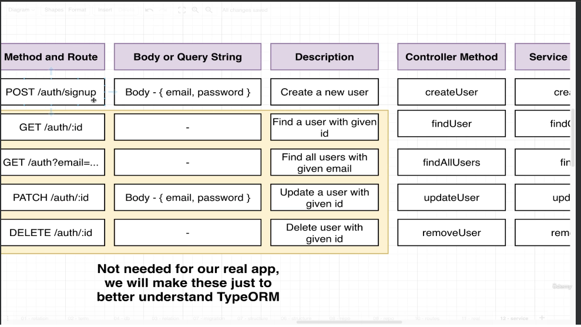
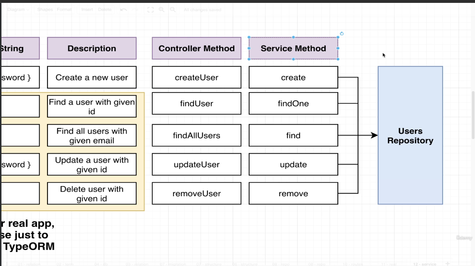

# Persisting Data With TypeORM.
> Persisting data with TypeORM refers to the process of saving data to the database using the TypeORM library in Node.js application. TypeORM is an object-relational Mapping (ORM) tool that allows developers to interact with a database using TypeScript or JavaScript object insted of writing raw SQL queries.
> Entity: Defines the structure of data you want to store.
> Repository: Abstraction layer that provides methods for querying and manipulating data related to a specific entity.
> TypeOrmModule.forFeatures([Report]) -> This line imports the repository for report entity. 
> .forFeature method is used to register specific entities with a module. By passing [Reports] we are telling NestJS that this module will work with the Report entity.


```
npm install @nestjs/typeorm typeorm sqlite3
```
> @nestjs/typeorm: Library that works typeorm and nest work together very nicely.
> typeorm: typeorm library itself.
> sqlite3: Database implementation.

>After doing all this we will get db.sqlite file. Sqlite is a file based database: it is going to store all the information related to a database inside of one single file.


> We will make user entity.
> We will make reports entity.
> Making both the entities required some steps.
> Let us look at making reports repository.
> Go to reports folder -> create a file (reports.entity.ts).
```
import { Entity, Column, PrimaryGeneratedColumn} from 'typeorm';

@Entity()
export class Report {
    @PrimaryGeneratedColumn()
    id: number;

    @Column()
    price: number;
}
```
> Now within reports.module folder.
> import typeOrmModule and also import Report entity.
```
@Module({
  imports: [TypeOrmModule.forFeature([Report])], // Here we will add our actual entity of reports.
  controllers: [ReportsController],
  providers: [ReportsService]
})
```
> Now inside app.module.ts file we will import report and add it as entity.

## Let us understand the TypeORM Decorators.
> Let us understand why synchronize is true and what are the things which are there. Lot more.
```
@Module({
  imports: [TypeOrmModule.forRoot({
    type: 'sqlite',
    database: 'db.sqlite',
    entities: [User, Report],
    synchronize: true
  }),
  UsersModule, ReportsModule],
  controllers: [AppController],
  providers: [AppService],
})
```
> Migrations: If we want to change the structure of our database we run a migration. Migration is a very carefully designed very little peice of code that changes the little peice of code of our database.
> We have not done anything like migration within our data base because we have a setting called.
```
synchronize = true;
```
> This is only for use in a development environment.
> This feature will tell typeorm to have a look at all the different entities and then automatically update the structure of database. This is all done automatically with the help of Entities and all those different decorators.



## Quick Note On Repository.

> These repositories have a set of methods that we are going to work with within our database.

>There are some methods which looks very similar.
```
1. save() vs insert() and update().
2. remove() vs delete().
```



## Setting Up Body Validation.
> Step1: Go to users.controller.ts and set up a post request for signup.
> Step2: If we are setting up a request for signup then we also need to validate it. Inside our main.ts file we will do that. To set up validation inside nest application we are going to create a DTO and to create DTO we are going to create that class validator package. We also have to do some high level setup for our app. Specifically in our main.ts file.
> Step3: Add the DTO to the post request handler. Update main.ts file and tell nest that we are going to use that global validation pipe.
> DTO's are used to validate incoming request bodies.
> To validate we will install class-validator and class-transformer package inside our project.
```
inside main.ts file.
app.useGlobalPipes(
  new ValidationPipe({
    whitelist: true,
  })
);
// app.useGlobalPipes(...) -> This line configures a global validation pipe for your entire Nest.js application. A global pipe applied to all incoming requests and response.
// whitelist: true -> When set to true, this option ensures that only properties defined in your DTO classes are allowed during validation. Any additional properties not defined in the DTO will be stripped out.
```