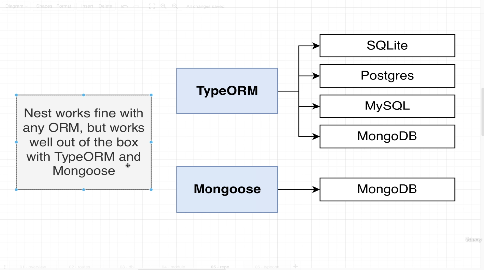
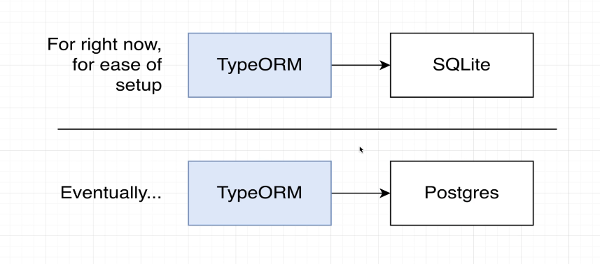
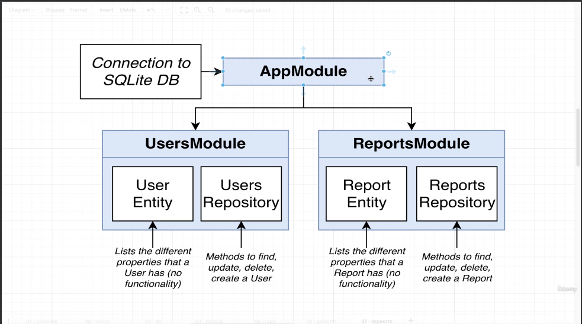
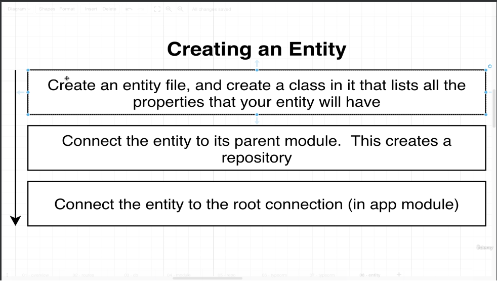

# Persisting Data With TypeORM.
> Persisting data with TypeORM refers to the process of saving data to the database using the TypeORM library in Node.js application. TypeORM is an object-relational Mapping (ORM) tool that allows developers to interact with a database using TypeScript or JavaScript object insted of writing raw SQL queries.


```
npm install @nestjs/typeorm typeorm sqlite3
```
> @nestjs/typeorm: Library that works typeorm and nest work together very nicely.
> typeorm: typeorm library itself.
> sqlite3: Database implementation.

>After doing all this we will get db.sqlite file. Sqlite is a file based database: it is going to store all the information related to a database inside of one single file.
