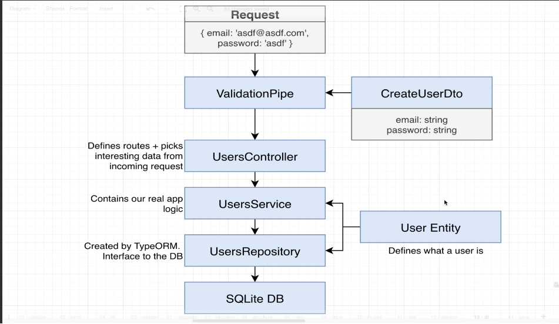
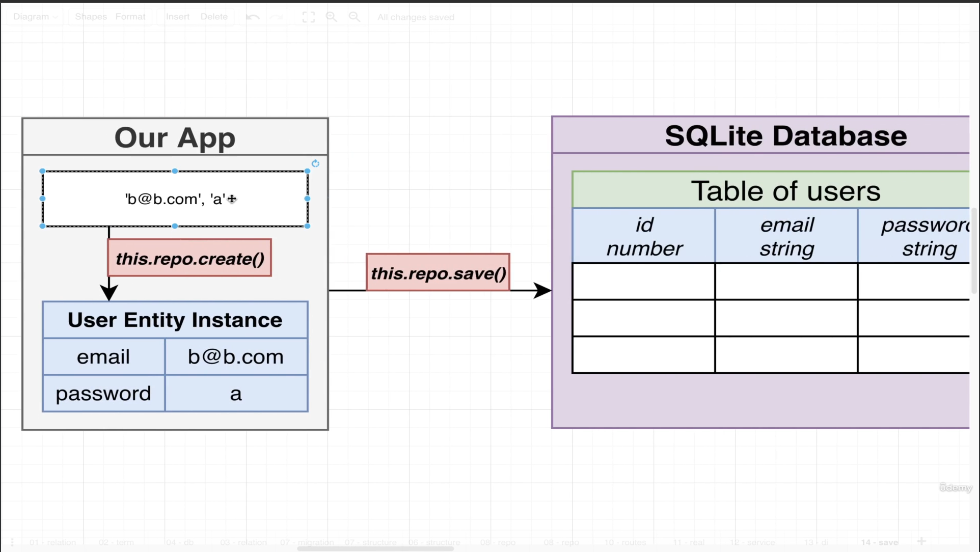
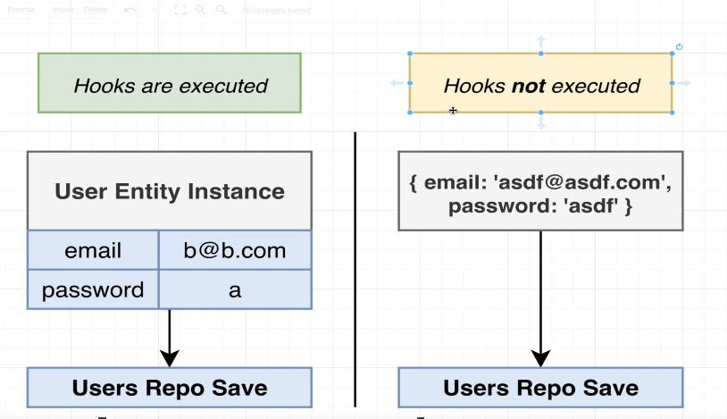
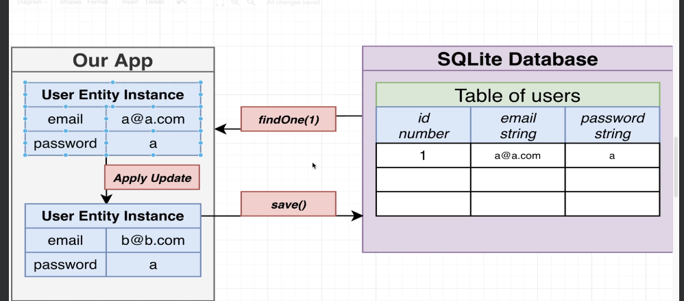
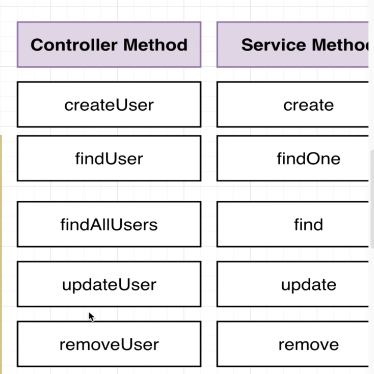
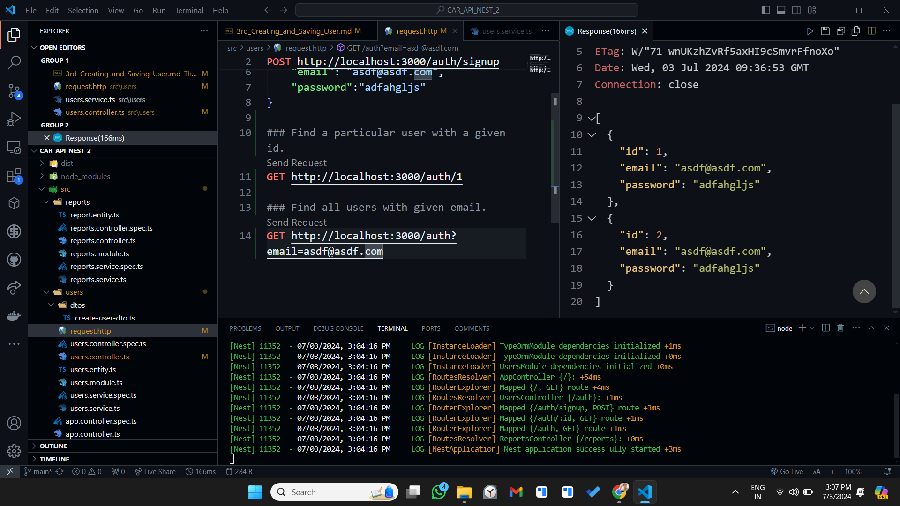
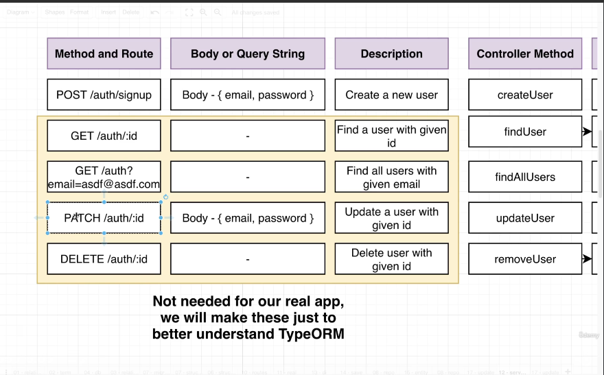
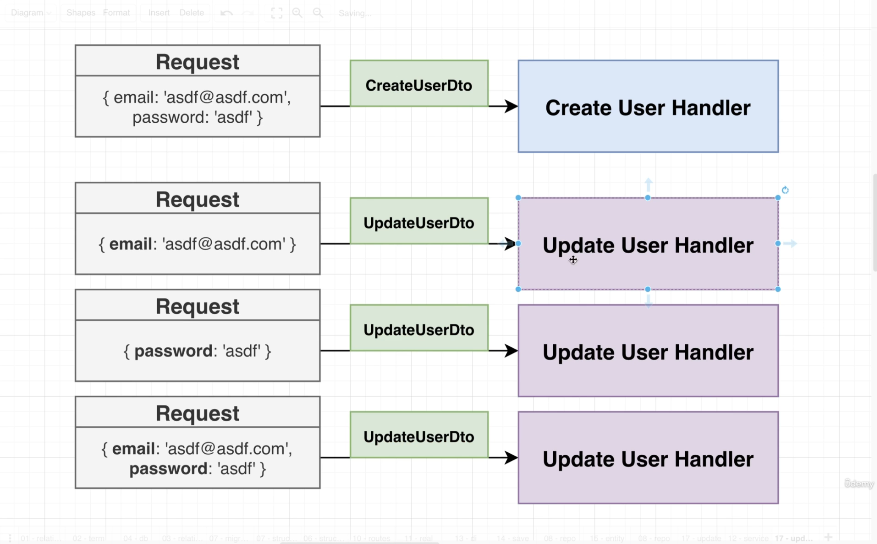
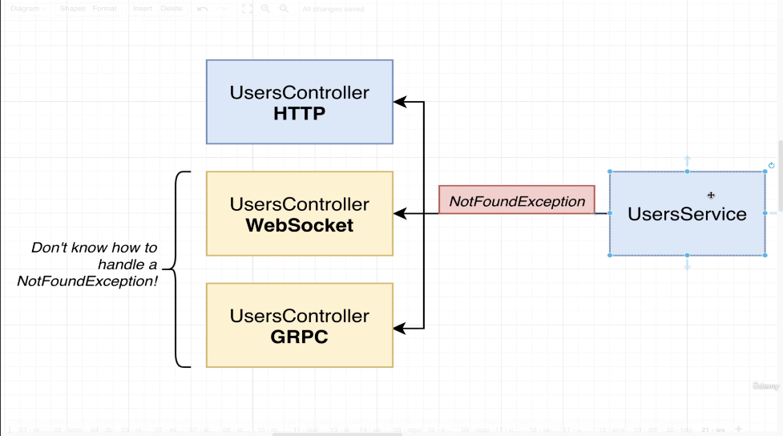

# Creating and saving user.
> We have setup our repositories by using Typeorm and now we are going to Create and Save user data within our application.
> We are going to create Service methods. Which are then used to access Users Repository. We are going to do that hookup using Dependency Injection.

> First We have created users.services.ts file and then we have imported it within users.controller.ts.

### What is going on inside our project.


### Difference between create and save method.


## More On Create VS Save. Video 53.
> Suppose that we wants to add a function that is going to log out ever operation that we do on user. In another words if we try to create a new user and save it to the database if we try to update a user or remove a user. I wants to do a console log that says we are updating, saving or whatever. 
> One way we can easily do this by using a feature within Typeorm called Hooks. Hooks allows us to define a function within an entity that will be called automatically at points on time.
> Within our user.entity.ts let us define a function logInsert() {} and after that we import AfterInsert decorator and mark logInsert() {} as AfterInsert() {}. Whenever we create a new user within our database, this function should get executed.
```
@AfterInsert() 
    logInsert() {
        console.log('Inserted User With ID', this.id); // Here this is a reference to the entity that we just inserted.
    }
```
> We are going to do the same process whenever we update a user, or remove a user. To handle them we are going to create two other decorators. 
> Import AfterRemove, AfterUpdate.
```
@AfterUpdate() 
logUpdate() {
    console.log('Updated user with id', this.id);
}

@AfterRemove() 
logRemove() {
    console.log('Removing user with id', this.id);
}
```
> We can call save either with a user entity instance or just a plain object either way our data will be saved. The difference however if we save an entity instance all the hooks which are tied to that instance will be executed but if we pass an object and we try to save it no hooks will get executed.


## Querying for Data - Video 55.
> We have got our first route handler put together now we are going to work with other one's.
> Different route handlers which we need to put together are very similar to the route handlers which we have already seen in messaging application.
> Let us first focus on creating all the different methods for our service. Like: create, findOne, find, update, remove. Then we will focus on TyprOrm working and how we can interact with users repository in efficient way. After service methods putting together, we will put all the route handlers for controller.
> Go to users.service.ts and then start creating these methods.
```
findOne(id: number) {
    return this.repo.findOneBy({id}); // We already have this method within our repository.
}
find(email: string) {
    return this.repo.find({where: {email}});
} 
update() {}
remove() {}
```
> The difference between findOne and find is that findOne is always going to return one record for null if no user is found with that given criteria. Find on the other hand is going to return an array of all the different records that match that search criteria. If no records are found with that given criteria then we will get an empty array.

## Video 56 - Update Data.
> Let us try to work upon update method. 

```
// Let us think about the parameters. If we pass it like below.
update(id: number, newEmail: string, newPassword: string) {}
// If we will pass it like above then suppose if a person only wants to update password but at the same time he also will have to update the password. So, this is not a good approach.
```
> Instead of above we will use below.
```
async update(id: number, attrs: Partial<User>) {
    const user = await this.findOne(id); // Finding a user with a given id is an asynchronous operation that is why we are using await keyword here.
    // If we do not find the user then we will use below.
    if(! user) {
        throw new Error('user not found');
    }
    // If we do find the user then we will use a built in function. Object.assign().
    Object.assign(user, attrs); // We are going to take all the properties of attrs and copying them directly to the user overwritting any properties that are already there. 
    return this.repo.save(user);
} 
```
> attrs: Attributes.
> Users: Reference to our user entity.
> Partial: Type Helper defined in typescript itself. This partial type Helper tells us that attrs can be any object that has atleast or none some of the properties of user class. So if we provide any object that has no properties, or some properties or has atleast one properties of user that will be considered as a valid argument.

## Video 57: Remove operation.
> This is going to be similar to the update.
```
// Remove is worked to work with Entity. Delete is there to work with a plain id.
// Means we need to go within our database. We need to fetch that entity and remove on it.
// Two round trips: one to get a user and another to remove it.
async remove(id: number) {
    const user = await this.findOne(id); // Finding a user with given id.
    if(! user) {
        throw new Error('User not found');
    }
    return this.repo.remove(user);
}
```
> Now our service is in a good spot. Now all we have to do is to go back to our controller and we have to define couple of route handlers inside of here and call the associated methods. And then we will do manual route handling.

## Video 58: Finding and Filtering Records.
> Now lets add all the different route handlers within our controller.

> We are going to pull out some information from the incoming request and then pass that information along with the relevant method which we have just defined inside our service. Some of these are really going to be easy and straight forward others are little bit more complicated in nature.
> Go to Users.Controller.ts and import Get, Patch, Param, Query. These are all different decorators which we are going to use to implement these remaining route handlers.
> The first handler that we will put together is the one that fetch with the user with the very particular id. For that inside our controller we will add the get decorator.
```
@Get('/:id')
findUser(@Param('id') id:string) {
    // Inside our database our id's are going to be stored as numbers. But whenever we receive a request. Every single part of the URL is string even if we think that it is a number. We need to take that string and parse that string into a number.

    return this.usersService.findOne(parseInt(id));
}
```
> Now go to API client and try to test out that route handler.
> Then We will define the function for find All Users.
```
// Because we want to pull out some information from query string, we will make use of query decorator.
@Get()
findAllUsers(@Query('email') email:string) {
    return this.usersService.find(email);
}
```
> Then go to API Client and try to test out that route handler again. If we won't be able to find out the email, we will get an empty array instead.


## Video 59: Removing Records.
> Now we will take care of Delete.
> We are going to delete that using a Controller method removeUser.
```
@Delete('/:id')
removeUser(@Param('id') id: string) {
    return this.usersService.remove(parseInt(id));
}
```
> Check using ThunderClient.

## Video 59: Updating Records.

> Update the user with a given id. We have a PATCH request coming up. It is going to have a body with email and password that we want to handle a user with. This is going to be more difficult then others because this is going to have a body. For creating a new user we have created a DTO's we might need the simiar kind of step to handle this updating records.

> Create an update-user-dto.ts file.
```
import { IsEmail, IsString, IsOptional} from 'class-validator';

export class UpdateUserDto {
    @IsEmail()
    @IsOptional()
    email: string;

    @IsString()
    @IsOptional()
    password: string;
}
```
> Now we will go back to our users-controller.
```
import { UpdateUserDto } from './dtos/update-user-dto';
@Patch('/:id')
updateUser(@Param('id') id: string, @Body() body: UpdateUserDto) {
    return this.usersService.update(parseInt(id), body);
}
```
> checking.
```
### Update a user.
PATCH http://localhost:3000/auth/2
content-type: application/json

{
    "email": "aaaa@aaaa.com"
}
```

## Video 61: A Few Notes On Exceptions.
> Specifically some of the errors which we are throwing inside our user service within some functions we are currently throwing some plain errors, ideally we will not throw some plain error objects because nest does not know that how to extract information from that. Instead we will throw some exceptions that are implemented or created by nest such as NotFoundException, BadRequestExeception all those other ones..
> In our messaging application we were throwing errors directly from controller but in this case we have our user service that is currently throwing some errors. In this case errors are coming form service not controller.

> If we start throwing some erros from HTTP specific errors from our user service, we start to have a tough time using this service on future controller which makes use of different communication protocols.

> There is an issue here if we are throwing errors from services. The issue is, We have UserService, We are saying that we probably wanted to throw not found exception. If we are going to throw some error it is going to flow back up right now to our userController which communicates over HTTP But remember, Nest Itself is designed assuming that you might eventually handle communication protocols besides HTTP requests. So For Example: We might eventually have another kind of controller inside of our application designed to handle web socket trafic, we also might have a different controller designed to handle gRPC requests. NotFoundExceptions are not compatible with any other kind of communication protocol. So if we throw an error like not found exception from the user service and that user service is being used by other kind of controllers, these controllers are not going to properly capture that error, extract information from it, and send a response back to whoever made the request for us. So, All i want you to understand is, IF we start throwing HTTP specific errors from our user service, we start to have a kind of tough time resusing this servic on future controller that make use of Different communication protocols.
> A very easy thing to do here is to make your own exceptional filter. But nest provide us that itself.
```
// within users.service.ts file.
import {NotFoundException} from 'nestjs/common';
// Rather then throwing this.
async remove(id: number) {
    const user = await this.findOne(id); // Finding a user with given id.
    if(! user) {
        throw new Error('User not found');
    }
    return this.repo.remove(user);
}

// We will throw.
async remove(id: number) {
    const user = await this.findOne(id); // Finding a user with given id.
    if(! user) {
        throw new NotFoundException('User not found'); // Changed.
    }
    return this.repo.remove(user);
}
// We will also do the same thing for remove method as well.
```
> We will also go to controller file and then we will update findOne method and we will add NotFoundException to findOne error.
```
// Updated Find User Function.
@Get('/:id')
async findUser(@Param('id') id:string) {
    // Inside our database our id's are going to be stored as numbers. But whenever we receive a request. Every single part of the URL is string even if we think that it is a number. We need to take that string and parse that string into a number.
    const user =  await this.usersService.findOne(parseInt(id));
    if(! user) {
        throw new NotFoundException('user not found');
    }
    else {
        return user;
    }
}
```
