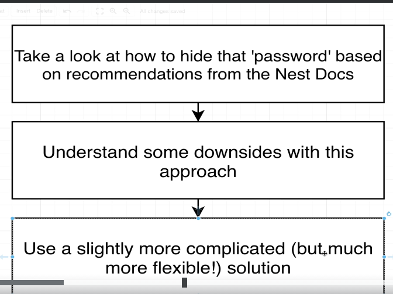
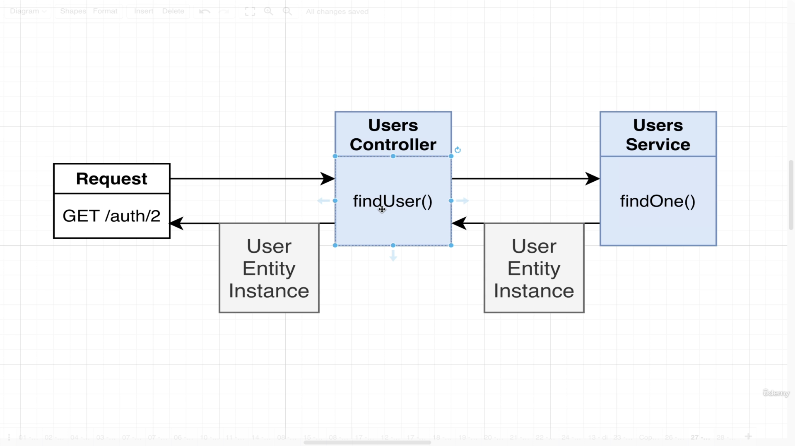
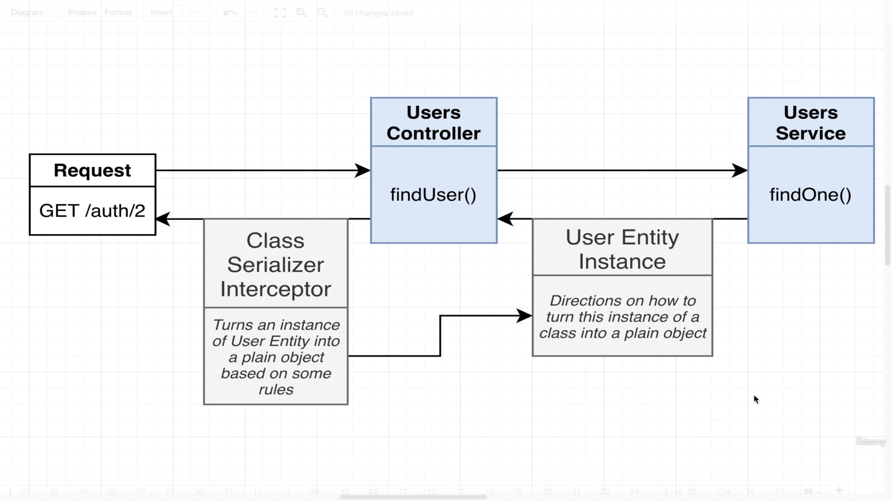
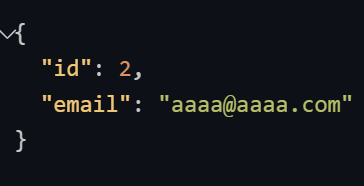
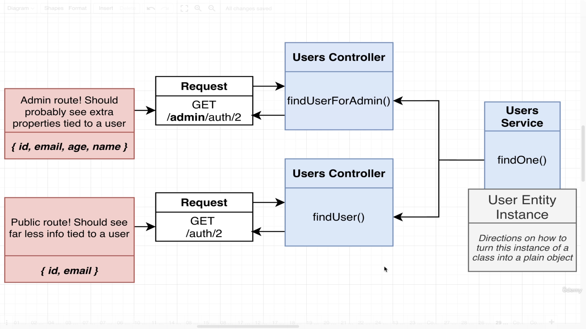
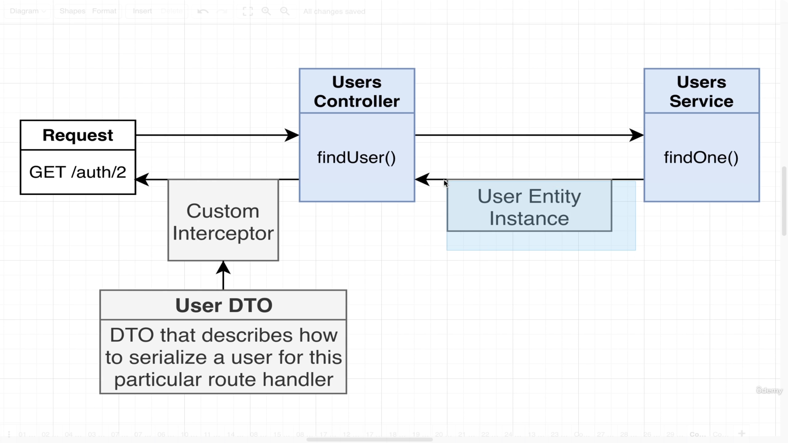
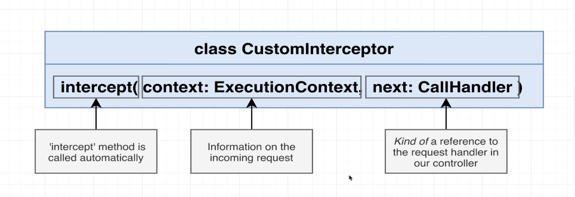
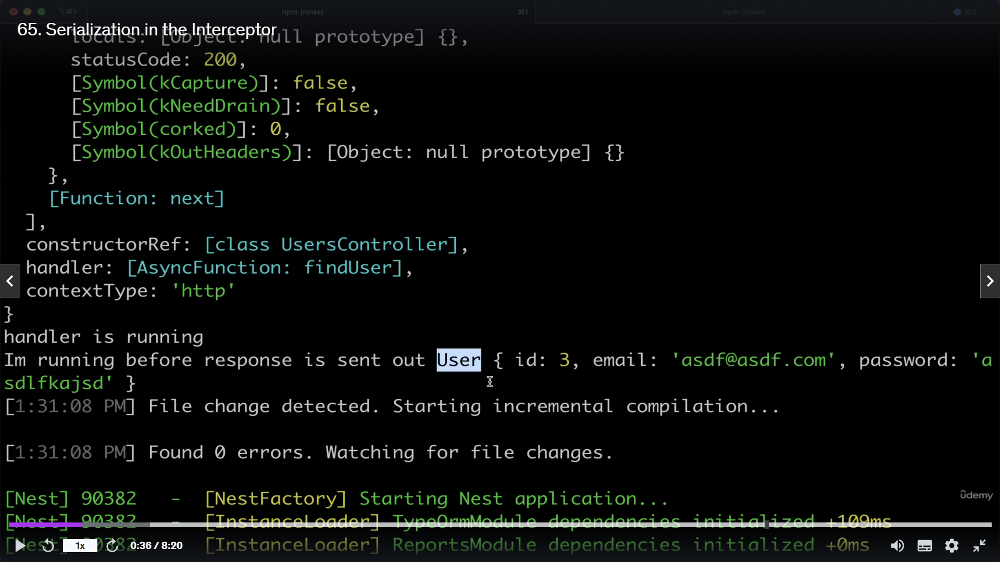
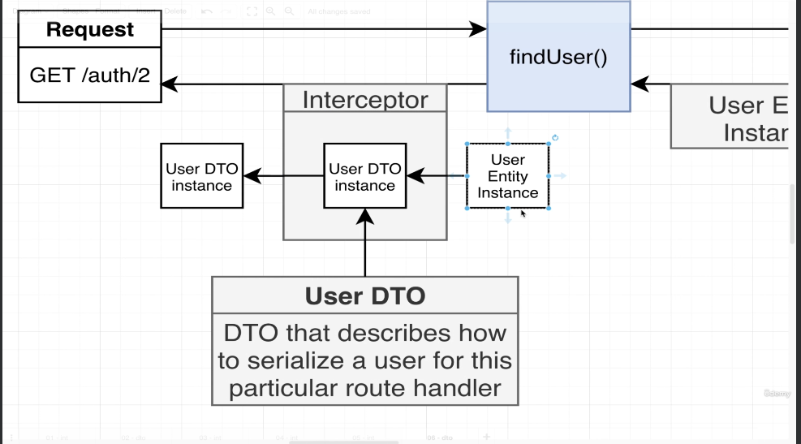

## Video 62 - Excluding Response Properties.
> Whenver we are sending reponse the password is showing. But we do not want it. We want to encrypt the password. There are some recommendations based upon nest that how to do it.
> Below is NestJS Documentation way of how to do that.

> Below is what is going on in our project right now.

> Below is what we are going to do.

> Go to user.entity file.
```
import { Exclude } from 'class-transformer'; // This will describe how to take an instance of user and turn it into a plain object. We are going to apply this exclude decorator to password property.
@Column()
@Exclude()
password: string;
```
> After that we will go to our users.controller.
```
import { UseInterceptors, ClassSerializerInterceptor } from '@nestjs/common';
@UseInterceptors(ClassSerializerInterceptor)
@Get('/:id')
async findUser(@Param('id') id:string) {
    // Inside our database our id's are going to be stored as numbers. But whenever we receive a request. Every single part of the URL is string even if we think that it is a number. We need to take that string and parse that string into a number.
    const user =  await this.usersService.findOne(parseInt(id));
    if(! user) {
        throw new NotFoundException('user not found');
    }
    else {
        return user;
    }
}
```
> Now our password gets encrypted and we can not see it.

> Even though it solved the issue, there are some downsides of this approach.

## Video 63 - Here we will see what are the downsides to the above approach to encrypt the password.

> At some point of time, we decide to store some more values of the user like their age, their mail, name etc.. and after that may be we want to add some admin functionality inside our application. So administrator should be able to look at lot of details about the user. To service that we might decide to add a new route handler to our application if user makes request from that we need to make sure that the request is coming from valid administrator. We will then setup a custom route handler just for that route that thing will reach out to the user service find a particular user and send tons of related information about that person. Their id, email, age, name and so on.
> We still might want to have another route where we want a person to look at id and email of our user and not the age and the name. This route handler will also reach out to the exact service and try to find one particular problem. 
> The problem here is that we wanna say that we will take the same kind of user entity and in both cases we want to send back that same user entity but between these two different route handlers we want to send back very different sets of information around that user. So we will have to apply different things for this but this is not possible with the approach recommended by the nest.
> That is the reason we will look at different method which will look at this issue very very easily.
> Below is what we are going to do.

> Inside this custom interceptor, we are going to serialize or turn our user entity instance into plain object and then into plain json by using some serialization rules setup inside DTO.
> Till this point of time, we have seen DTO's in incoming requests but the turn DTO's are not only used for handling incoming data but also for formating for outgoing data.

> One User DTO for admin controller. Second DTO for Second public Route. We are going to apply this custom interceptors inside each of our different route handlers.

## Video 64 - How to build interceptors.
> Interceptors can mess up with incoming requests as well as outgoing response.
> Interceptors can be applied to either a single route handler, all the handlers in controller or to entier controller or globally.

> Step1: Find User.entity.ts and remove the method which we have seen. The method which was given by NestJs Documentation.

> Inside src directory create a new folder interceptors. 
```
// It is going to take an object and serialize it eventually into json.
import {
    UseInterceptors,
    NestInterceptor,
    ExecutionContext,
    CallHandler
} from '@nestjs/common';
import { Observable } from 'rxjs';
import { map } from 'rxjs/operators';
import { plainToClass } from 'class-transformer';

// Implements is not same as extends: we use extends when we are subclassing an existing class, but we make use of implements anytime when we want to create a new class that satisfies all the requirements either in abstract class or in interface.
// By adding implements: typescript is going to check all the methods which are there within this interface NestInterceptor.

export class SerializeInterceptor implements NestInterceptor {
    intercept(context: ExecutionContext, next: CallHandler<any>): Observable<any> | Promise<Observable<any>> {
        throw new Error('Method not implemented.');
    }
    intercept(context: ExecutionContext, handler: CallHandler): Observable<any> {
        // Run something before a request is handled by the request handler.
        console.log('I am running before the handler', context);

        // Code that deals with outgoing request.
        return handler.handle().pipe(
            map((data: any) => {
                // Run something before the response is sent out.
                console.log('I am running before response is sent out', data);
            }),
        );
    }
}
```
> Inside controller we will go and include that class which we have defined.

## Video 65: Serialization in the interceptor.
> We have got the basics of interceptors down, now we are going to go and add some serialization logic.
> If we go to the terminal.

> As you can see in the image, we are still working with the instance of user entity inside of our interceptor.

> Normally whenever we finish all of our request handlers, whenever we finish all of these interceptors, Nest is going to take whatever is going to come out of this stuff and turn it into JSON for us.
> Usually this USER object will get turned into json. We are going to take an extra step in between, you and I going to take that user entity instance, we are then going to convert it into user DTO instance, this user DTO thing is going to have all of our serialization rules. Rules means it is going to say okay, I am going to show the password but not email or viceversa. We are then going to directly return that instance. Nest is going to take that object and turn it into JSON and will send that back into the response.
> Let us go and create USER DTO.
```
import { Expose } from 'class-transformer'; // Expose means share this property, Exclude means do share this property.
export class UserDto {
    @Expose()
    id: number;
    @Expose()
    email: string; 
}
```
> Now within serialize.interceptor.ts we will import the class. 
```
// It is going to take an object and serialize it eventually into json.
import {
    UseInterceptors,
    NestInterceptor,
    ExecutionContext,
    CallHandler
} from '@nestjs/common';
import { Observable } from 'rxjs';
import { map } from 'rxjs/operators';
import { plainToClass } from 'class-transformer';
import { UserDto } from 'src/users/dtos/user.dto';

// Implements is not same as extends: we use extends when we are subclassing an existing class, but we make use of implements anytime when we want to create a new class that satisfies all the requirements either in abstract class or in interface.
// By adding implements: typescript is going to check all the methods which are there within this interface NestInterceptor.

export class SerializeInterceptor implements NestInterceptor {
    intercept(context: ExecutionContext, handler: CallHandler): Observable<any> {
        // Run something before a request is handled by the request handler.
        // console.log('I am running before the handler', context);

        // Code that deals with outgoing request.
        return handler.handle().pipe(
            map((data: any) => {
                // Run something before the response is sent out.
                // console.log('I am running before response is sent out', data);
                return plainToClass(UserDto, data, {
                    excludeExtraneousValues: true,
                });
            }),
        );
    }
}
```
> Okay, But now we need to make a couple of improvements, we need to make sure that our interceptor is not hard coded to always use USER DTO because we might want to use this interceptor in many different locations inside our application. We might want to try to format outgoing responses that returns normally users but may be also photos or messages or blog posts or whatever else our application does.

## Video 66: Customizing the interceptor's DTO.
> There is one last thing which we have to do inside our interceptor, right now this thing is hard coded to always serialize outgoing information using the rules we had set up inside the user DTO. This is not appropriate because if we ever are returning other kinds of resource inside of our application from a request handler such as say, photos or messages or blogs posts or comments, we would want to serialize those other resources using a different DTO. So in other words we need to be able to customize that argument right there. 
> Ideally inside of our controller such as users controller, we would be able to import a DTO which we want to use formating outgoing response.
```
// Inside Controller.
import { UserDto } from './dtos/user.dto';
// We want to do.
@UseInterceptors(new SerializeInterceptor(UserDto)) // This is something what we want to do.
// to do so we just need to define constructor.
constructor(private dto: any) {}
// Change one more thing.
return plainToClass(this.dto, data, {
```
> But here again we got inside of our controller to setup all this interceptor stuff, it requires a really long line of code. That is a lot of stuff we need to worry about. Last thing we need to do, is to create something new to allow us to setup this interceptor without such a rediculously long line of code.

## Video 67: Wrapping the interceptor inside a Decorator.
> Very last thing which we are going to do here is to refactor or create something new so we do not need to write out such a long line of code. So to refactor this we are going to create our own very very simple custom decorator. This custom decorator is going to run exactly that.
```
export function serialize(dto: any) {
    return UseInterceptors(new SerializeInterceptor(dto));
}
```
> It is tipically difficult please watch the full video.
> Now, we again have a problem because we are having any type most of the places, we will try to fix it within next video. We will also see that we apply this serialize decorator inside our controller not only in this single request handlers.


