# User Authentication.
## Video 70: Authentication Overview and Flow.
> We are all done with intial take of this users related stuff.
> We are going to put below two route handlers to handle user signup and signin.

> Below is the general flow of Authentication in any of the framework.
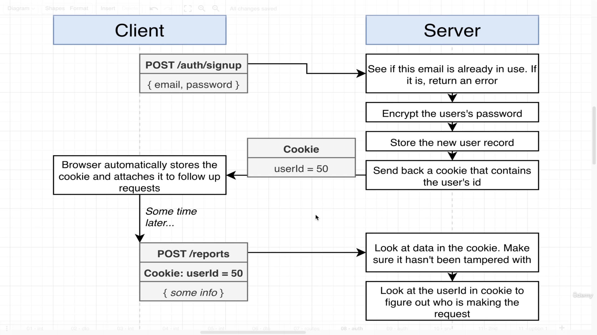
> To implement above authentication flow which is described in image 33.png. We have two options.
> Option 1.

> Option 2.

> When our application is smaller in size we would have gone with option number 1. Below is the problem with option 1.
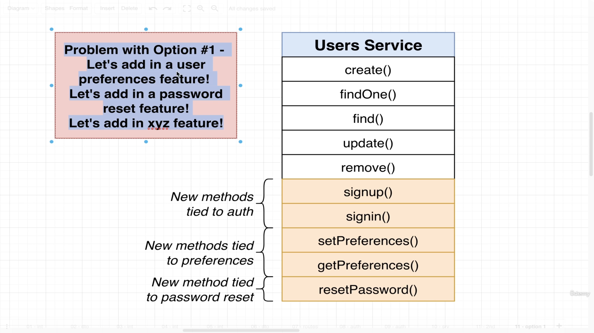
> We will go with option number 2. We are going to create a brand new service called authentication service and it is going to be responsible for everything related to signin and signup. It is going to rely upon some functionality that we already built on user's service.

## Video 71: Reminder on setting up a service.
> Dependency Hierarchy.

> Dependency Injection Overview.

> Fist: We are going to mark our classes as injectable.

> Second: If we ever going to need some other dependency we are going to add it into our list of constructor arguments.

> Third: Finally we are going to take our service and inside of our module we will add our service to the list of Providers.

> Users directory -> auth.service.ts
> We will make auth.service.ts and then import it into module.ts and add it into list of providers.
> We also need users service within auth service because they are dependent. We will import { User service} within auth.service.ts.

## Video 72: Implementing Signup Functionality.
```
import { BadRequestException, Injectable } from '@nestjs/common';
import { UsersService } from './users.service';

@Injectable()
export class AuthService {
    constructor(private usersService: UsersService) {}

    async signup(email: string, password: string) {
        // See the email is in use.
        const users = await this.usersService.find(email); 
        if(users.length) {
            throw new BadRequestException('email in use');
        }
        // Hash the password.
        
        // Create a new user and save it.

        // return the user.
    }

    signin() {

    }
}
```

## Video 73: Understanding Password Hashing.
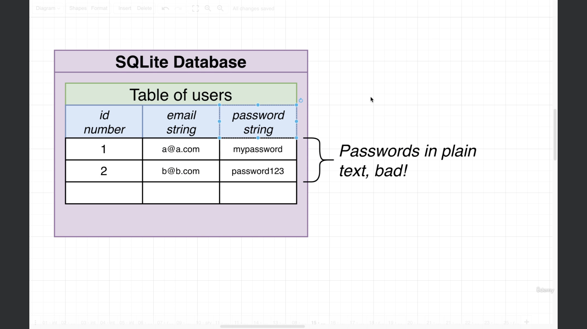
> Currently we are storing our passwords in plain text. But it is very bad. Because if any malacious person ever got a copy of our database. They will have the email and password of all our different users. The reason this is a big deal is not only because some malacious person can get singup in our application as another person its also a big deal because our users might use a same email and password combination as on our application as they do in other applications (Data breach in other website may lead to get access to different accounts).
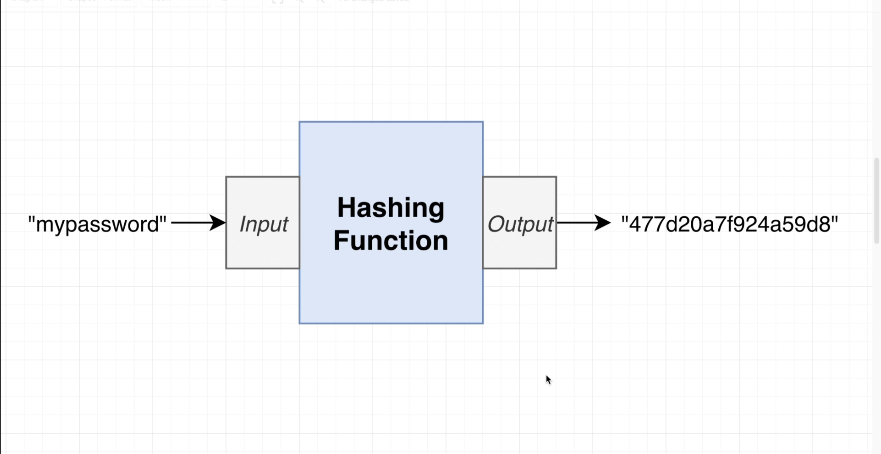
> We will use hashing function for storage of password.
> Hashing functions are not only used for password storage they are used for lot of security applications. We are not going to write out our own hasing function instead there are variety of different hashing functions that are already implemented within node standard library. So we are going to build them. 
> The goal of hashing function is to take some kind of input "any format" it is then going to calculate hash out of it and output a kind of "digital fingureprint". 
> We are going to get a string of numbers and letters. This string of numbers and letters has two very important characterstics around it.

## Two important characterstics of hashing function.
> First: If we ever going to change the input we are going to get back a completely different output. Same input string will give the same output.
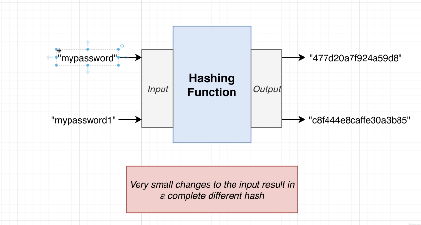
> Second: If we pass output value to the input we will never get orignal input.
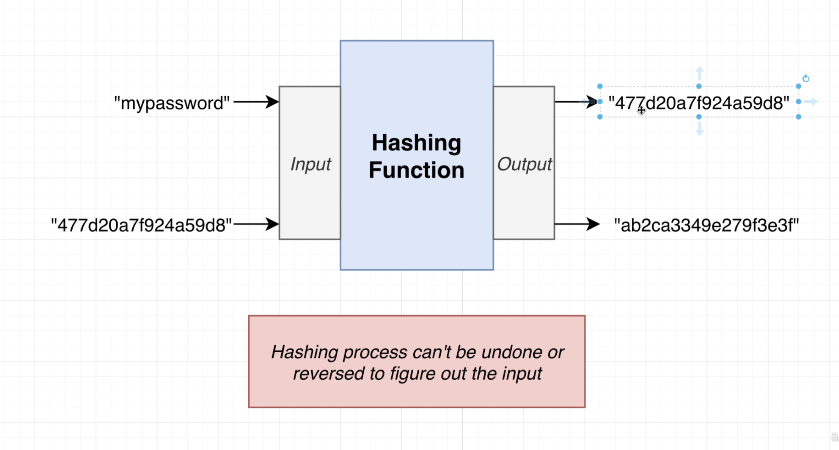

## Signup flow.
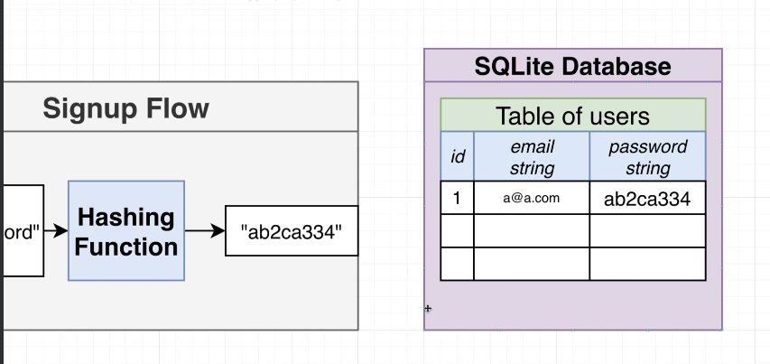

## Signin flow.
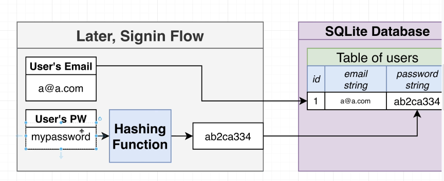

## Rainbow table attack.
> There is some malacious person who has stored some most popular passwords which are there in the world and then he will calculate the hash of all the time, they can just store it within a table. So if he got the access to our database anytime, they could have a look at hashed password.
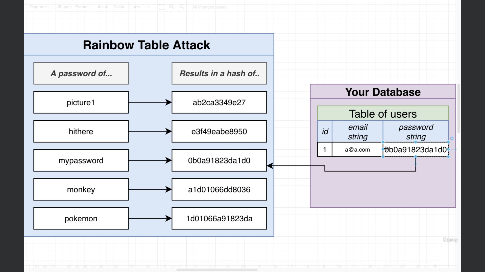

## Preventing Rainbow table attack.
> Salt: Random series of numbers and letters.

> Signup flow.

> Signin flow.
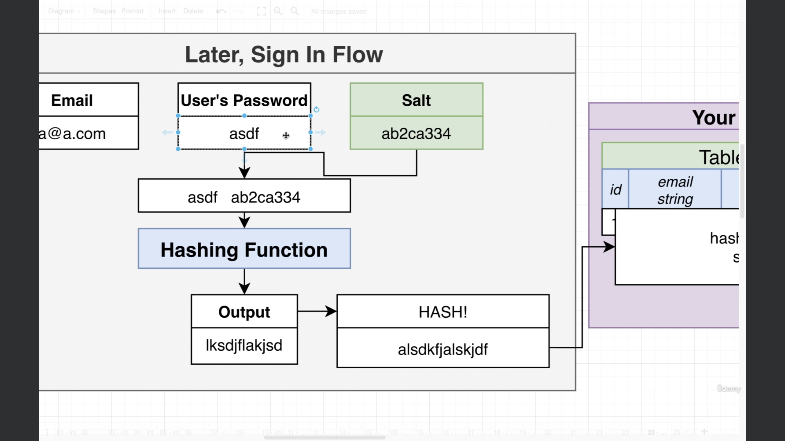

# Salting and hashing the password.
> We need to generate a salt, hash the salt along with the password and then store both the hash password and salt within our db.

within auth.service.ts -> 
> import { randomBytes, scrypt as _scrypt} from 'crypto';
// Crypto package is a part of node standard library, randombytes(we are going to use to generate our salt) scrypt: actual hashing password. This scrypt function is asynchronous in nature. Rather than giving us promise we will have to use call backs. So, we will do one more extra thing in order to remove this means in order to make sure that scrypt gives us promise so we do not have to use callbacks.
> import { promisify } from 'util';
Promisify is a function that will take a function that will make use of callbacks and it is going to give us back a version of that exact same function that makes use of promises.
const scrypt = promisify(_scrypt);
// Generate a salt.
> const salt = randomBytes(8).toString('hex');
// The `randomBytes(8).toString('hex')` function generates a cryptographically strong pseudorandom string of 8 bytes (64 bits) and converts it to a hexadecimal representation. Each byte is displayed using two characters in hexadecimal format. So, the resulting string will be 16 characters long, representing the 8 random bytes¹². For example, it might produce something like `ee48d32e6c724c4d`. 😊
> const hash = (await scrypt(password, salt, 32)) as Buffer; // 32: will give us back 32 characters or 32 bytes. Buffer will get returned by calling scrypt function.
// Join the hash result and the salt together.
> const result = salt + '.' + hash.toString('hex');
// Create a new user and save it.
> const user = await this.usersService.create(email, result);
// return the user.
return user;

## Video 76: Handling User Sign In.

## Video 77: Setting up Sessions.
> We have setup signup and signin the user. But we still do not have the ability to say whether this person is signed in and this person is not signed in. That is where this cookiee stuff will come.
> There is a package which is named as cookieSession. 
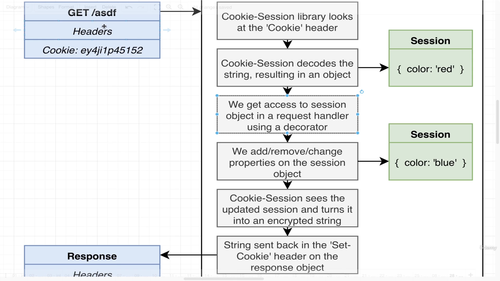
> We need to install some of the libraries.
```
npm install cookie-session @types/cookie-session
```
> Then we are going to find our main.ts file and we are going to wire up our cookie session middleware inside here at the very top.
```
// Import cookie session object.
const cookieSession = require('cookie-session'); // we have to use require method in order to import this because of some settings.

app.useGlobalPipes( 
    new ValidationPipe({
      whitelist: true
    })
  )
```
## Video 78: Changing and Fetching Session Data.
> Inside of here we are going to understand how to make use of cookie session and the session object that it creates.
> We will write some code and then we will delete it at the end of the video.
> I want a new Get request handler inside of my users controller.
```
// Below is how we can store information on this session object.
    @Get('/colors/:color')
    setColor(@Param('color') color: string, @Session() session: any) {
        session.color = color;
    }
    // How can we retreive the session object on follow up request very easily.
    @Get('/colors')
    getColor(@Session() session:any) {
        return session.color;
    }
```
> then check.
```
### Get the color.
GET http://localhost:3000/auth/colors
```

## Video 80: Getting the current user.
> In this video we are going to put another route handler. Just to make sure that the session stuff is working as expected. The goal of this route handler is to tell user who they are currently signed in our application as. 
```
@Get('/whoami')
whoAmI(@Session() session: any) {
    return this.usersService.findOne(session.userId);
}
// Checking.
### Get the currently signed in user.
GET http://localhost:3000/auth/whoami
```
## Video 81: Signing out the user.
> We should also allow the user to sign out of our application.
> for this we will add another route handler that will deals with user to signed out.