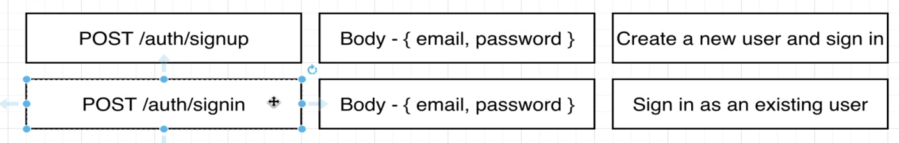
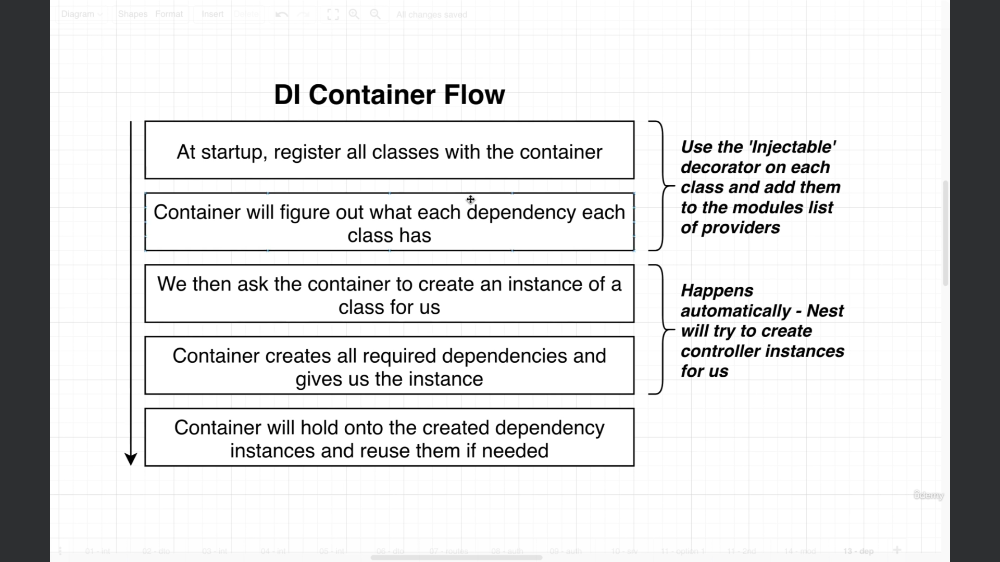

# User Authentication.
## Video 70: Authentication Overview and Flow.
> We are all done with intial take of this users related stuff.
> We are going to put below two route handlers to handle user signup and signin.

> Below is the general flow of Authentication in any of the framework.

> To implement above authentication flow which is described in image 33.png. We have two options.
> Option 1.

> Option 2.

> When our application is smaller in size we would have gone with option number 1. Below is the problem with option 1.

> We will go with option number 2. We are going to create a brand new service called authentication service and it is going to be responsible for everything related to signin and signup. It is going to rely upon some functionality that we already built on user's service.

## Video 71: Reminder on setting up a service.
> Dependency Hierarchy.

> Dependency Injection Overview.

> Fist: We are going to mark our classes as injectable.

> Second: If we ever going to need some other dependency we are going to add it into our list of constructor arguments.

> Third: Finally we are going to take our service and inside of our module we will add our service to the list of Providers.

> Users directory -> auth.service.ts
> We will make auth.service.ts and then import it into module.ts and add it into list of providers.
> We also need users service within auth service because they are dependent. We will import { User service} within auth.service.ts.