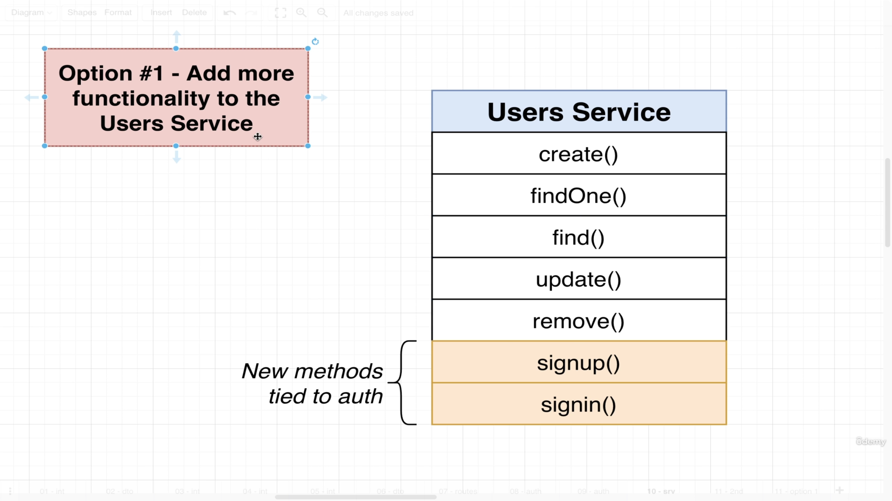

# User Authentication.
## Video 70: Authentication Overview and Flow.
> We are all done with intial take of this users related stuff.
> We are going to put below two route handlers to handle user signup and signin.

> Below is the general flow of Authentication in any of the framework.

> To implement above authentication flow which is described in image 33.png. We have two options.
> Option 1.

> Option 2.

> When our application is smaller in size we would have gone with option number 1. Below is the problem with option 1.

> We will go with option number 2. We are going to create a brand new service called authentication service and it is going to be responsible for everything related to signin and signup. It is going to rely upon some functionality that we already built on user's service.