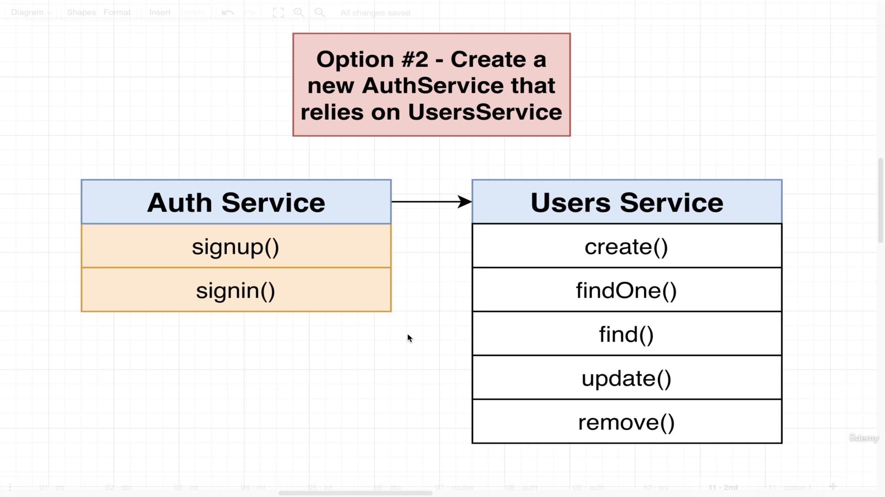
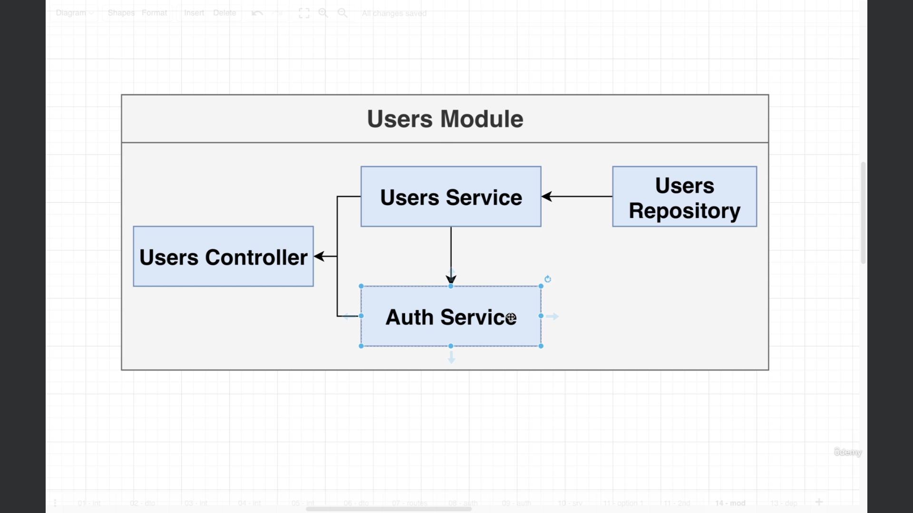
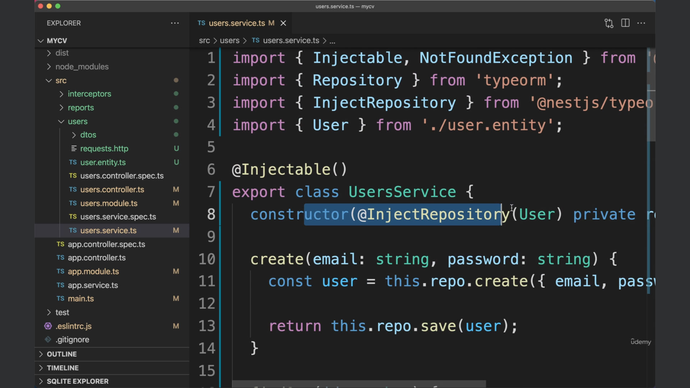

# User Authentication.
## Video 70: Authentication Overview and Flow.
> We are all done with intial take of this users related stuff.
> We are going to put below two route handlers to handle user signup and signin.

> Below is the general flow of Authentication in any of the framework.

> To implement above authentication flow which is described in image 33.png. We have two options.
> Option 1.

> Option 2.

> When our application is smaller in size we would have gone with option number 1. Below is the problem with option 1.

> We will go with option number 2. We are going to create a brand new service called authentication service and it is going to be responsible for everything related to signin and signup. It is going to rely upon some functionality that we already built on user's service.

## Video 71: Reminder on setting up a service.
> Dependency Hierarchy.

> Dependency Injection Overview.

> Fist: We are going to mark our classes as injectable.

> Second: If we ever going to need some other dependency we are going to add it into our list of constructor arguments.

> Third: Finally we are going to take our service and inside of our module we will add our service to the list of Providers.

> Users directory -> auth.service.ts
> We will make auth.service.ts and then import it into module.ts and add it into list of providers.
> We also need users service within auth service because they are dependent. We will import { User service} within auth.service.ts.

## Video 72: Implementing Signup Functionality.
```
import { BadRequestException, Injectable } from '@nestjs/common';
import { UsersService } from './users.service';

@Injectable()
export class AuthService {
    constructor(private usersService: UsersService) {}

    async signup(email: string, password: string) {
        // See the email is in use.
        const users = await this.usersService.find(email); 
        if(users.length) {
            throw new BadRequestException('email in use');
        }
        // Hash the password.
        
        // Create a new user and save it.

        // return the user.
    }

    signin() {

    }
}
```

## Video 73: Understanding Password Hashing.

> Currently we are storing our passwords in plain text. But it is very bad. Because if any malacious person ever got a copy of our database. They will have the email and password of all our different users. The reason this is a big deal is not only because some malacious person can get singup in our application as another person its also a big deal because our users might use a same email and password combination as on our application as they do in other applications (Data breach in other website may lead to get access to different accounts).

> We will use hashing function for storage of password.
> Hashing functions are not only used for password storage they are used for lot of security applications. We are not going to write out our own hasing function instead there are variety of different hashing functions that are already implemented within node standard library. So we are going to build them. 
> The goal of hashing function is to take some kind of input "any format" it is then going to calculate hash out of it and output a kind of "digital fingureprint". 
> We are going to get a string of numbers and letters. This string of numbers and letters has two very important characterstics around it.

## Two important characterstics of hashing function.
> First: If we ever going to change the input we are going to get back a completely different output. Same input string will give the same output.

> Second: If we pass output value to the input we will never get orignal input.


## Signup flow.


## Signin flow.


## Rainbow table attack.
> There is some malacious person who has stored some most popular passwords which are there in the world and then he will calculate the hash of all the time, they can just store it within a table. So if he got the access to our database anytime, they could have a look at hashed password.


## Preventing Rainbow table attack.
> Salt: Random series of numbers and letters.

> Signup flow.

> Signin flow.

